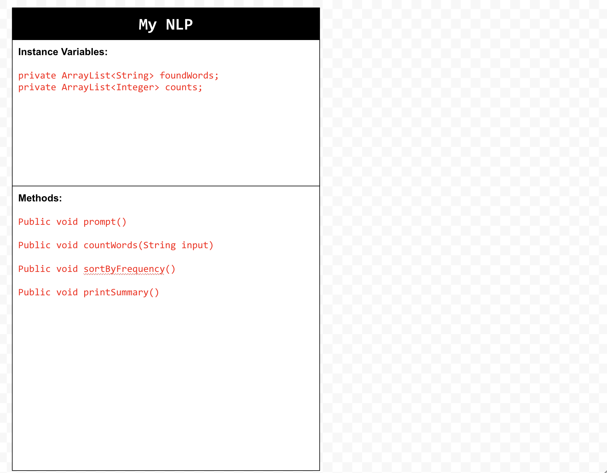
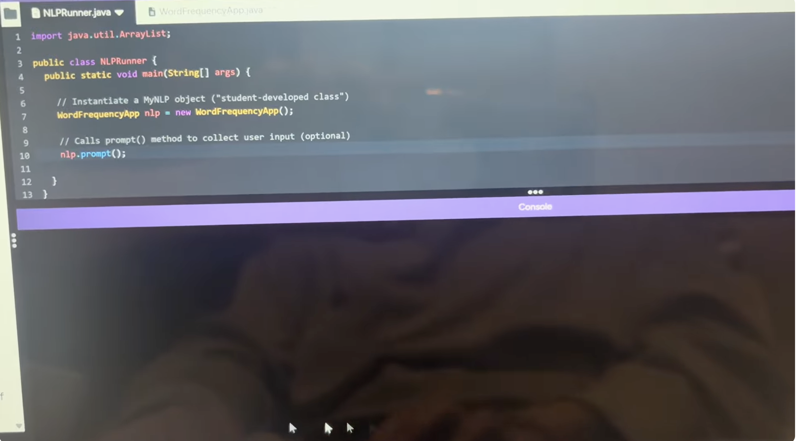

# Natural Language Processing Project
# Unit 6 - Natural Language Processing Project

## Introduction

Natural language processing (NLP) is used in many apps and devices to interact with users and make meaning of text to determine how to respond, find information, or to create new text. Your goal is to use natural language processing techniques to identify structure, patterns, and meaning in a text to have conversations with a user, execute commands, perform manipulations on the text, or generate new text.

## Requirements

Use your knowledge of object-oriented programming, ArrayLists, the String class, and algorithms to create a program that uses natural language processing techniques:

- **Create at least two ArrayLists** – Create at least two ArrayLists to store the data used in your program, such as data from text files or entered by the user.
- **Implement one or more algorithms** – Implement one or more algorithms that use loops and conditionals to find or manipulate elements in an ArrayList or String object.
- **Use methods in the String class** - Use one or more methods in the String class in your program, such as to divide text into sentences or phrases.
- **Use at least one natural language processing technique** – Use a natural language processing technique to process, analyze, and/or generate text.
- **Document your code** – Use comments to explain the purpose of the methods and code segments and note any preconditions and postconditions.

## UML Diagram

## Video

Record a short video of your project to display here on your README. You can do this by:

- Screen record your project running on Code.org.
- Upload that recording to YouTube.
- Take a thumbnail for your image.
- Upload the thumbnail image to your repo.
- Use the following markdown code:

## Project Description

The goal of our application is to find how many times each word in the sentence (given by user input into the console) is said. Whatever sentence that they type into the console will return a list of each of the words in the sentence and a number representing how many times each word appeared in the sentence. We did not use text files in our project. 

## NLP Techniques

The natural language technique that we implemented into out project was the word frequency analysis. The main method for our project, the countWords method, is what is associated with NLP. This method iterates through the sentence and stores each word in a foundWord variable in order to count how many times each word appears in the sentence. This is necessary in the NLP technique because we are using word frequency analysis, so we would have to keep track of the frequency of each word in the given sentence.

